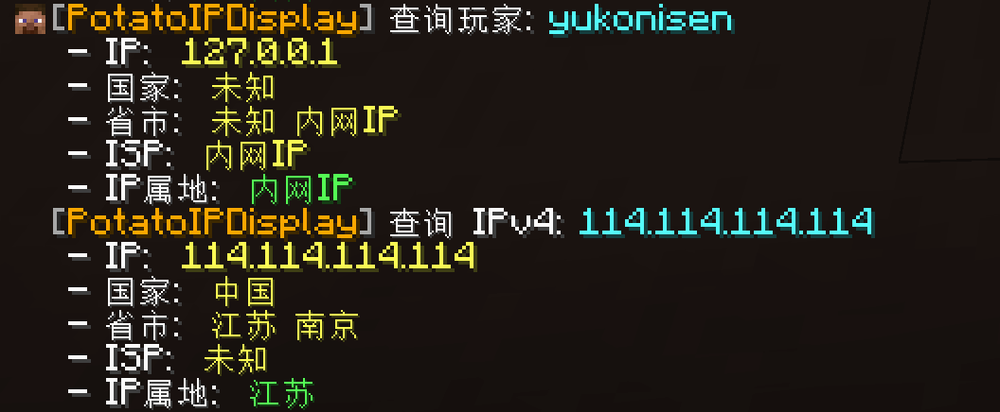

# 命令

## 命令列表 {#list}

| 命令                                    | 描述                     | 权限                        | 默认 |
|:--------------------------------------|:-----------------------|:--------------------------|:---|
| /pipd                                 | 等效于 `/potatoipdisplay` | `potatoipdisplay.command` | OP |
| /potatoipdisplay                      | 插件信息                   | `potatoipdisplay.command` | OP |
| /potatoipdisplay about                | 显示关于信息                 | `potatoipdisplay.command` | OP |
| /potatoipdisplay clear [player/cache] | 清除玩家/查询缓存              | `potatoipdisplay.command` | OP |
| /potatoipdisplay lookup [玩家/IPv4]     | 查询玩家或IP                | `potatoipdisplay.lookup`  | OP |
| /potatoipdisplay reload               | 重载插件                   | `potatoipdisplay.reload`  | OP |

示例：使用 /potatoipdisplay lookup 命令分别查询玩家和 IP 的归属地信息：

