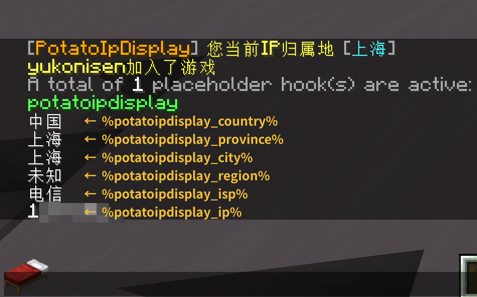

# 介绍

[PotatoIpDisplay](https://github.com/dmzz-yyhyy/PotatoIpDisplay) 是一款用于显示玩家Ip归属地的Minecraft插件，支持 Bukkit 和 Velocity。

在玩家加入服务器后，插件会根据配置的模式查询玩家的 IP 归属地信息，并支持注册 Placeholder API 变量。

## 功能

- 指定查询模式
- Placeholder API 支持
- 内置基本的消息格式化功能（见下图）**（默认关闭）**

## 使用方法 (Bukkit) {#installation_bukkit}

1. 将插件 `PotatoIpDisplay-1.x-bukkit-all.jar` 放进 `plugins/`
2. 启动服务器
3. 修改配置文件。可参考 [配置文件说明](configuration)。
4. 重启服务器 ~~或重载插件（施工中）~~

## Placeholder 变量 {#placeholders}

| 变量                           | 描述      | 返回示例        |
|:-----------------------------|:--------|:------------|
| `%potatoipdisplay_ip%`       | 玩家的 IP  | `11.45.1.4` |
| `%potatoipdisplay_country%`  | IP 所属国家 | `中国`        |
| `%potatoipdisplay_province%` | IP 所属省份 | `上海`        |
| `%potatoipdisplay_city%`     | IP 所属城市 | `上海`        |
| `%potatoipdisplay_district%` | IP 所属区  | `未知`（可能无法识别） |
| `%potatoipdisplay_isp%`      | 运营商信息   | `联通`        |

## bStats

