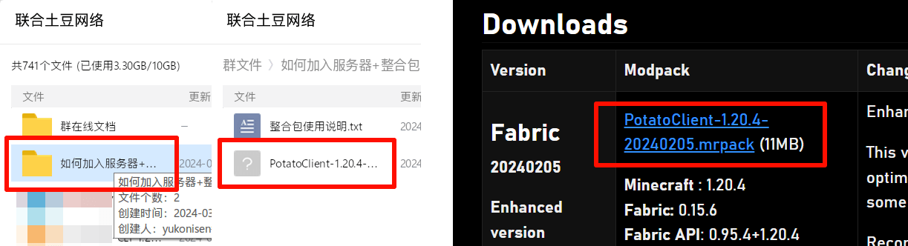
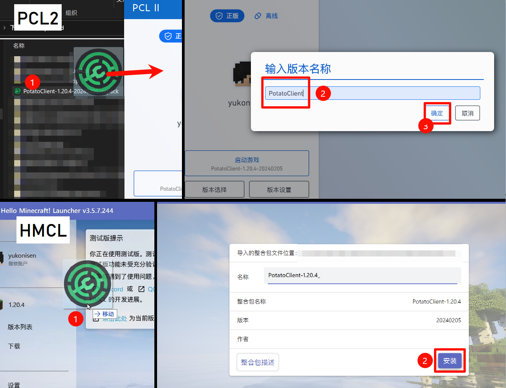

# 如何加入服务器

本文将以 Windows 平台和 PCL2 为例，并假设你具备一定的计算机基础知识，介绍如何通过 PC 平台加入服务器。

## 准备账户

土豆网络为 PC 版玩家提供两种验证的方法，**正版模式** 和 **外置登录**。正版账户需要购买获得，如果你经过考虑后觉得自己更喜欢外置登录，请转至 [LittleSkin](https://littleskin.cn/) 注册一个新账户。如果已拥有一个账户，请跳过此步。

按照步骤注册 LittleSkin 账户后，请在“[角色管理](https://littleskin.cn/user/player)”页面添加一个角色。

**注意：** 用户名长度为 3-16 个字符，且不允许包含汉字及除下划线"`_`"外的任意符号（含空格）。

## 配置启动器

:::info 大佬看这里……

如果你想使用自己的客户端，请手动添加我们的服务器地址：`upt.curiousers.org`

:::

虽然原版 Minecraft 也可以加入服务器，但整合包的作用是开箱即用、优化和增强游戏功能，推荐使用。

**整合包可以从 QQ 群文件或[ 我们的网站 ](https://portal.curiousers.org/events/potato-s18.html)获取。** 

然后，就可以使用你喜欢的启动器导入我们的整合包了。

> 如果在安装时遇到网络问题，请自备代理。