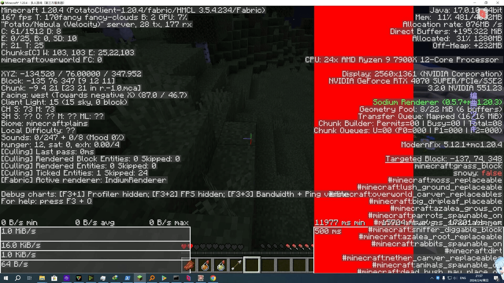

# 一些常见网络问题的解决方案

:::warning 请注意
如果你是中国大陆玩家，由于众所周知的原因，服务器在某些时候可能会出现网络波动。因此，我们建议你使用网络加速器。

一些免费的加速器（如 OurPlay 等）即可很好地代理 Minecraft 流量。
:::

## 无法代理 Minecraft {#PT-19-00}

| PT-19-00     | [BUG] 加速器无法代理 Minecraft |
|:--------------|:--------------|
| 复现/详细描述 |  平台：Windows 10 22H2; PCL2 最新; PotatoClient (1.20.4) 版本20240203; Zulu 17 JRE   OurPlay 始终无法代理 Minecraft，尝试过原版客户端及HMCL启动器均出现该问题。 |
| 提出         |     [2023-02-04] 由 yukonisen 提交。  |
| 解决 | [2023-02-04] 将 Java 更换为 [Oracle JDK 17](https://www.oracle.com/java/technologies/downloads/#java17) 并使用 PCL2 已解决。由 NightFish2009 解决。 |

我们认为这是加速器对 **Java 进程** 的识别问题。

> ↑ 在某种**极端网络环境**下，可以看到延迟突破 1 万毫秒。2024-02-04, yukonisen, NightFish2009。