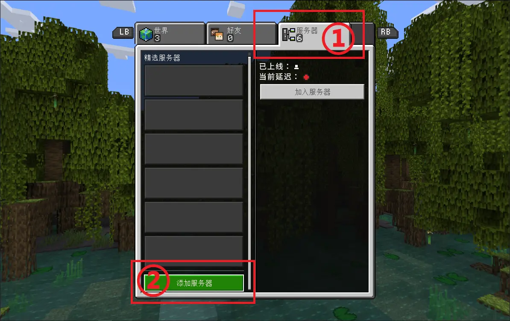

# 准备基岩版客户端

| 平台     | 系统版本要求 | 商店页面
| ----------- | :-----: | :-----: |
| Windows     | 10 (19041.0) 或更高 | [微软商店](https://www.microsoft.com/p/minecraft-for-windows/9nblggh2jhxj)
| Android | 5.0 或更高 | [Google Play](https://play.google.com/store/apps/details?id=com.mojang.minecraftpe&hl=en_US) |
| 主机平台 | / | [PlayStation](https://www.playstation.com/games/minecraft/) / [Switch](https://www.nintendo.com/store/products/minecraft-switch/) / [Xbox](https://www.xbox.com/en-US/games/store/minecraft/9mvxmvt8zkwc)
| iPhone/iPad | iOS/iPadOS 11.0 或更高 | [App Store](https://apps.apple.com/app/minecraft/id479516143)

## 添加服务器

在“服务器”页面，单击最下方的“添加服务器”

输入以下信息，并单击“保存”：

| 服务器名称     | 服务器地址 | 端口 |
| ----------- | :-----: | :-----: |
| *任意*     | `be.curiousers.org` | `15397` |