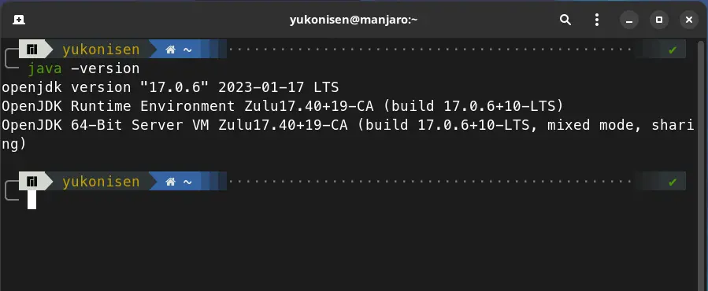
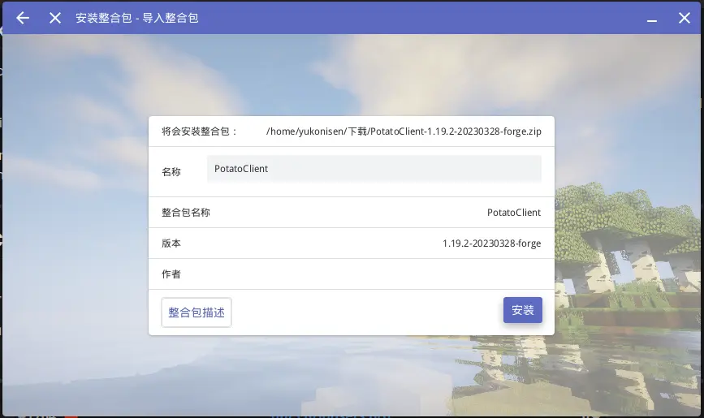
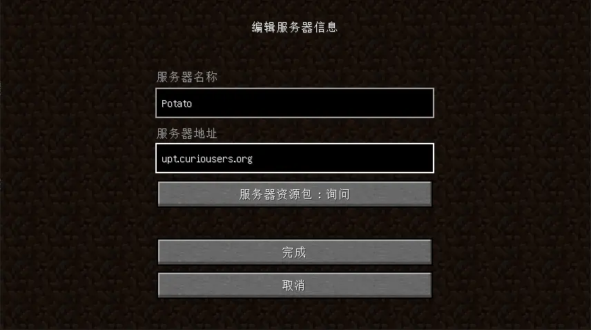

# 准备 Java 版客户端

您需要先自行准备 JRE (现代 Minecraft 要求 Java >= 17)，比如 [Azul Zulu JRE 17](https://www.azul.com/downloads/?version=java-17-lts&architecture=x86-64-bit&package=jre#zulu)，并推荐为其设置 `JAVA_HOME` 变量。

通过以下命令检查：

```shell
java -version
```



此外，您也需要一个 Minecraft 启动器，比如 [HMCL](https://hmcl.huangyuhui.net/download/)，[PCL2](https://afdian.net/p/0164034c016c11ebafcb52540025c377)，[官方启动器(官网)](https://www.minecraft.net/zh-hans/download)，[官方启动器(Xbox)](https://www.xbox.com/zh-cn/games/store/minecraft-launcher/9pgw18npbzv5)。（任选，不建议首选官启）

## 导入整合包 (Curse)

**推荐！** 适合大多数玩家的方便快捷方法。除了已内置服务器的地址，也包含了我们推荐的一些增强和优化插件。

方法：使用受支持的启动器导入我们提供的整合包，[**下载地址（未发布）**](#)（下载后得到一个 zip 文件）。

对于 HMCL，请在主页选择“版本列表”——“安装整合包”，然后选择刚刚下载的文件。




> 常见的第三方启动器包括 PCL2、HMCL 等，对导入整合包有完整的支持。要使用官启，请通过 CurseForge 导入整合包。

## 添加服务器

如果您是安装的整合包得到的游戏版本，请跳过这个部分，因为服务器地址已经内置。

在“多人游戏”页面，选择“添加服务器”。

输入以下信息，并单击“保存”：

| 服务器名称     | 服务器地址 |
| ----------- | :-----: |
| *任意*     | `upt.curiousers.org` |

