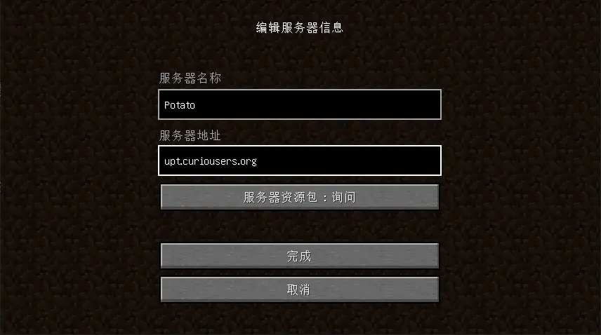

# 加入 Potato（手动）

## 注意

:::caution
此篇文档**不适用**于基岩版客户端。如果您使用 Android, iOS, Nintendo Switch, PlayStation 或 Xbox 平台，则应参考 [基岩版文档](beclient)。
:::

您需要先自行准备 JRE (现代 Minecraft 要求 Java >= 17)，比如 [Azul Zulu JRE 17](https://www.azul.com/downloads/?version=java-17-lts&architecture=x86-64-bit&package=jre#zulu)，并推荐为其设置 `JAVA_HOME` 变量。

通过以下命令检查：

```shell
java -version
```


此外，您也需要自行准备一个 Minecraft 启动器，比如 [HMCL](https://hmcl.huangyuhui.net/download/)，[PCL2](https://afdian.net/p/0164034c016c11ebafcb52540025c377)，[官方启动器(官网)](https://www.minecraft.net/zh-hans/download)，[官方启动器(Xbox)](https://www.xbox.com/zh-cn/games/store/minecraft-launcher/9pgw18npbzv5)。

## 添加服务器

在“多人游戏”页面，选择“添加服务器”。

输入以下信息，并单击“保存”：

| 服务器名称     | 服务器地址 |
| ----------- | :-----: |
| *任意*     | `upt.curiousers.org` |



最后，选中刚刚添加的服务器，并单击 “加入服务器”。